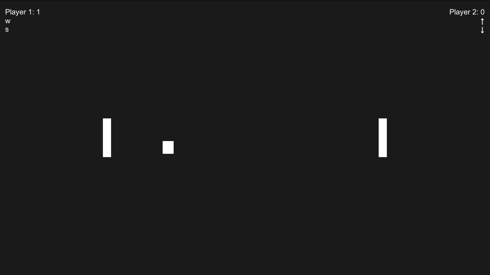

# Pong

So I was bored and got the idea to make Pong in an hour, which is exactly what I did and that is also why some of the code might be a little messy or cluttered or unpolished or what have you.

Even though I ended up making the core game in an hour, I spent an additional hour on some polish and I added sound effects, a master volume slider and a pause menu.
